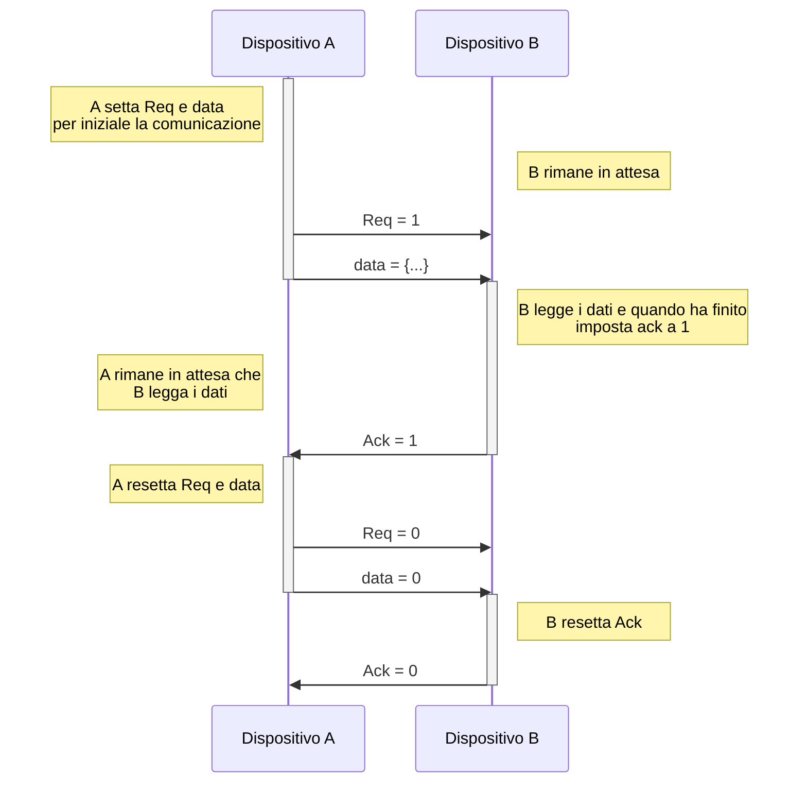

# Input e output

I dispositivi I/O sono quei dispositivi che ci permettono di interagire con il nostro computer.

ogni sottosistema di un computer comunica con gli altri attraverso dei **bus** cioè dei canali di comunicazione che sono fisicamente composti da fili che veicolano segnali elettrici.

Sono presenti vari tipi di bus:

- System bus: connettono CPU e memoria RAM
- backplane: connettono schede di espansione aggiuntive, sono standard (ad esempio PCIe quindi schede video, ssd NVMe, scheda di rete)
- IO: serve per connettere le periferiche principali, come mouse tastiera, microfono, ma anche hard disk

Questi 3 tipi di bus si differenziano per prestazioni e lunghezza che possono raggiungere.

 
## BUS sincrono

Nel bus sincrono le operazioni vengono regolate da un clock condiviso, quindi tutte le richieste hanno un tempo specifico e uguale per tutti per essere concluse. Questo tipo di bus viene utilizzato nei percorsi brevi come tra CPU e memoria RAM (su linee di bus più lunghe il segnale di clock potrebbe disallinearsi)

## Bus asincrono

nei bus asincrono non è presente un clock condiviso (ma ogni periferica ha il proprio) e la comunicazione può avvenire in qualsiasi momento, viene utilizzato dai dispositivi USB, SATA, PCIe. Per verificarsi la comunicazione ha bisogno di una sincronizzazione iniziale tra le periferiche chiamata **handshake**.

La comunicazione tra due periferiche in bus asincrono avviene tramite 3 segnali: Req(1bit), Ack(1bit), e il segnale dati (grandezza variabile).

Simuliamo che il dispositivo A vuole mandare dei dati al dispositivo B:

1. Inizialmente tutti i segnali sono a 0
2. A inserisce i propri dati nella segnale `data` e invia il segnale di richiesta (`Req`) a B
3. B si accorge che il segnale `Req` è a 1 e quindi legge i dati. Quando ha finito di leggere imposta `Ack` a 1
4. A riceve il segnale `Ack = 1` e quindi reimposta `Req` e `data` a 0
5. infine anche B resetta il segnale `Ack` a 0

## Arbitraggio a Daisy chain

Quando più dispositivi utilizzano lo stesso bus è necessario regolare l'accesso per evitare conflitti.
Un metodo per farlo è l'arbitragggio a daisy chain.

È presenta un arbitro per dara l'accesso al bus, mentre i dispositivi che richiedono l'accesso al bus sono posti a catena in cui il più vicino all'arbitro ha la priorità più alta.

Abbiamo 3 segnali condivisi tra i dispositivi:
- request: il dispotivo invia la richiesta all'arbitro di accedere al bus
- grant: l'arbitro da l'accesso al bus
- release: il dispositivo finisce le sue operazioni sul bus

Ipotizziamo che il device 2 voglia accedere al bus:

1. il device 2 imposta `request` a 1
2. l'arbitro nota la richiesta ma essendo il segnale condiviso tra i dispositivi non sa da chi provenga
3. l'arbitro imposta il segnale `grant` a 1 che va al device 1 che è quello con la priorità più alta
4. Il device 1 può decidere se accedere al bus (rubandolo quindi al device 2) oppure propagare il segnale al device successivo
5. Se decide di propagare allora il device 2 può accedere al bus come da lui richiesto
6. una volta terminate le sue operazioni sul bus imposta il segnale `release` a 1 e l'arbitro resetta il segnale `grant`

Seppure questa tecnica è molto semplice da realizzare non è molto ottimale perché i dispositivi a bassa priorità potrebbero non avere mai accesso al bus. Esistono tecniche più ottimali ma sono più complesse da realizzare.

## Gestione dell'IO (I controller)

Un'operazione di input/output è un trasferimento di dati che può avvenire:
- da un dispositivo alla memoria RAM (**input**)
- dalla memoria RAM ad un dispositivo (**output**) 

Per effettuare questi trasferimenti abbiamo bisogno dei **controller**, che non è altro che un piccolo processore dedicato che possiede ogni dispositivo.

In generale ogni controller deve possedere dei registri che permettano interagire con il processore:

- **command register**: utilizzato per inviare dei comandi al controller (output)
- **status register**: utilizzato per sapere lo stato del dispositivo (input)
- **data write register**: utilizzato per inviare dei dati nel dispositivo (output)
- **data read register**: utilizzata per ricevere dei dati dal dispositivo (input)

Per comunicare con i controller esiste un l'approccio chiamato **Memory Mapped IO**:
I registri dei dispositivi sono mappati in delle locazioni di memoria specifica per loro.
Per la CPU non c'è differenza al modo di accedere a quei registri (farà delle normali load e store).
È compito della MMU (Memory Management Unit) di indirizzare le richieste a un dispositivo oppure alla RAM.

### Polling

Il polling è una tecnica per fare operazioni con i dispositivi in cui la CPU controlla periodicamente lo stato del dispositivo per vedere se ci sono dei dati da prelevare. Può essere utile quando un dispositivo ha spesso dei dati da comunicare.
La CPU però spreca molto tempo a controllare ogni volta lo stato del dispositivo

### Interrupt-driven IO
In quest'altra tecnica è il dispositivo che avvisa la CPU (tramite un interrupt) che di sono dei dati disponibili.
Questa tecnica è molto vantaggiosa per dispositivi che comunicano poco di frequente, questo perché gli interrupt sono molto dispendiosi per la CPU e se avvengono troppo spesso la CPU avrà un grosso calo di performance

## DMA

In entrambe le tecniche precedenti viene sempre coinvolta la CPU nelle operazioni con lo scopo di fare da collegamento tra dispositivo e RAM, ma la CPU ha altre operazioni più importanti da fare (come eseguire i programmi)

Viene introdotto quindi un controller esterno alla CPU chiamato **DMA** (Direct Memory Access) che si occupa dell'interazione tra dispositivi e RAM. La CPU fornisce semplicemente quanti dati trasferire e dove trasferirli, il trasferimento effettivo viene fatto dal DMA. Quando tutti dati saranno trasferiti il DMA farà un interrupt alla CPU.

