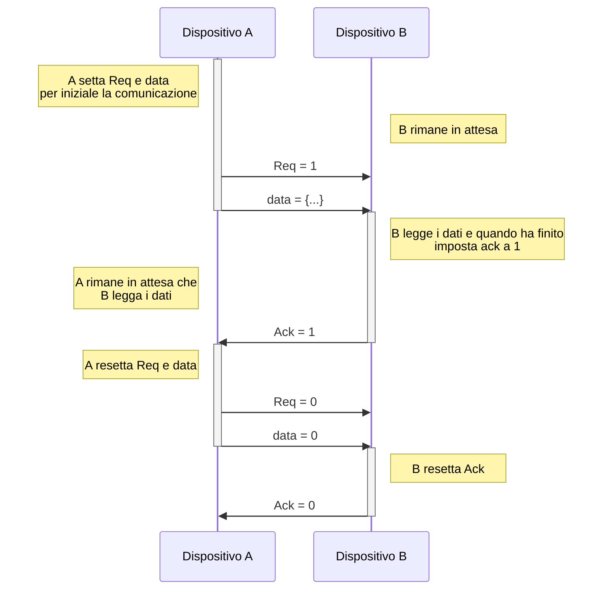

# Nozioni introduttive

## ISA

**l'Istruction Set Architecture** si occupa principalmente di definire il formato e le istruzioni disponibili nel linguaggio macchina. Descrive inoltre:
- i registri disponibili
- i tipi di dato
- input e output
- gestione della memoria

la realizzazione hardware di un ISA viene detta **implementazione**, ogni implementazione di ISA può variare in costi, performance e dimensioni.

### Assembly

Il linguaggio assembly è un linguaggio a basso livello che associa alle sequenze di bit le relative istruzioni in un formato più  comprensibile per il programmatore.

Il codice assembly dipende dall'ISA implementato dal processore.

## MIPS e ARM

MIPS e ARM sono due architetture diverse, nella prima ci soffermeremo a livello teorico mentre nella secondo la affronteremo a livello più pratico.

### MIPS

- Presenta 32 registri lunghi una *word* (4byte = 32bit)
- Tutte le istruzioni sono anche lunghe una *word* e seguono i seguenti formati:
	- R-type (istruzioni aritmetico logiche)
	
	- I-type (load word, store word e salto condizionato)
	
	- J-type (salto non condizionato)
	
- Ogni registro del MIPS ha un nominativo associato e ha un utilizzo specifico:

- **Modi di indirizzamento** rappresentano l'utilizzo degli operatori di una istruzione.


## CISC e RISC

CSIC e RISC sono due tipologie di architettura che differiscono molto tra loro.

L'architettura RISC (Reduced Instruction Set Computer) è utilizzata sia dai processori ARM che MIPS e come dice il nome presenta un ridotto numero di istruzioni ma molti registri, è più semplice da implementare, ha consumi minori e quindi più efficiente 

d'altra parte l'architettura CISC (Complex Instruction Set computer) è utilizzata dai processori Intel con la loro versione x86 e si tratta di un'architettura più completta, che presenta un numero maggiore di istruzioni e pochi registri, le istruzioni hanno formato variabile e le istruzioni possono avere più operandi del normale. In sintesi è molto più complesso implementare questo tipo di architettura. 
È però più flessibile perché puoi fare la stesso cosa in molti modi diversi e supporta meglio i sistemi legacy


# CPU pipeline

La caratteristica che contraddistingue questa CPU da quella a singolo e multi ciclo è il fatto che la CPU pipeline riesce a lavorare in **parallelo su più istruzioni**.

Sebbene questo non renda le singole istruzioni più veloci (in alcuni casi pure più lente) rappresenta un notevole aumento performance per quanto riguarda il numero di istruzioni completate in unità di tempo rispetto agli altri due tipi di CPU.

## Funzionamento

Per capire il funzionamento prendiamo in considerazione lo schema per la cpu a singolo ciclo (con lo stesso instruction set del modulo 1)


Suddividiamolo in 5 fasi che rappresentano gli step dell'esecuzione di una istruzione:

- Instruction fetch (**IF**)
	lettura dell'istruzione e incremento del PC
- Instruction decode (**ID**)
	decodifica dell'istruzione e lettura registri coinvolti
- Execute (**EX/EXE**)
	calcolo opearzione aritmetica / calcolo indirizzi di memoria ram/ calcolo indirizzo branch
- Memory access (**MEM**)
	accesso alla memoria ram per lettura o scrittura
- Write back (**WB**)
	scrittura nei registri


L'idea sarebbe che queste 5 istruzioni vengono fatte contemporaneamente ma su istruzioni diverse.


Dato che ciascuna istruzione ha bisogno del risultato della fase precedente abbiamo bisogno di inserire dei **registri intermedi** per memorizzarmi i vari risultati tra i cicli di clock.


Infine vanno aggiunti i segnali di controllo.

## Hazard

Con il termine hazard o criticità si indica un fenomeno in cui l'esecuzione dell'istruzione dipende dai risultati dell'istruzione precedente, creando così una **dipendenza**.

Le dipendenze creano degli **stalli** nella CPU. Lo stallo viene scoperto durante la fase ID e l'istruzione stessa e tutte le successive entrano in stallo.

Lo stallo viene risolto solo quando l'istruzione dipendente viene completata così da sbloccare l'istruzione che la richiedeva.

Dato che ogni fase deve lavorare ad ogni ciclo di clock, quando si presenta uno stallo è possibile che per alcune fasi non ci siano istruzioni da fare, vengono quindi introdotte le istruzioni **nop** o **bubble** cioè delle istruzioni che non fanno nulla ma servono a tenere impegnata quella fase.

Esempio di istruzioni che creano uno stallo:

```
add $s1, $t0, $t1
sub $s2, $s1, $s3 
```

l'istruzione `sub` entra in stallo perché richiede il registro $s1 che non è stato ancora aggiornato dall'istruzione `add`. Diciamo che la seconda istruzione dipende dalla precedente

La dipendenza implica che non possiamo modificare l'ordine delle istruzione senza alterare il risultato

### Tipi di dipendenza (data hazards)

#### Dipendenza RAW

*Read After Write* avviene quando un'istruzione legge un registro scritto da una istruzione precedente.

Es.

	add $s1, $t0, $t1 // write $s1
	sub $t2, $s1, $t3 // read $s1

#### Dipendenza WAW

*Write After Write* avviene quando un'istruzione scrive in un registro scritto da una istruzione precedente.

Es.

	add $s1, $t0, $t1 // write $s1
	sub $s1, $s2, $t3 // write $s1

#### Dipendenza WAR

*Write After Read* avviene quando un'istruzione scrive in un registro letto da una istruzione precedente.

Es.

	add $t0, $s1, $t1 // read $s1
	sub $s1, $s2, $t3 // write $s1


Mentre le dipendenze di tipo WAR e WAW possono generare problemi sono nel caso in cui la cpu esegue le istruzioni in modo disordinato (out-of-order execution),
la dipendenza che capita più spesso e anche più importante è quella di tipo RAW:


La gestione degli stalli viene fatta dalla *Hazard detection unit* che è contenuta nella fase ID e quello che fa è semplicemente confrontare i registri coinvolti nell'istruzione corrente con quegli delle istruzioni precedenti.

### Register file ottimizzato

Il register file ottimizzato è un register file che permette la lettura e la scrittura nello stesso ciclo di clock, più precisamente nella fase di salita del clock avviene la scrittura mentre nella fase di discesa avviene la lettura.

Questo permette di allineare la fase WB con quella ID di due istruzioni diverse.

### Forwarding

Per ottimizzare le dipendenze di tipo RAW che sono le più frequenti possiamo utilizzare il fatto che il dato precedente di cui abbiamo bisogno viene prodotto nello stato EXE e quindi non serve aspettare la fase WB. Questa tecnica viene chiamata **forwarding**.

Esempio con register file ottimizzato e forwarding.


il forwarding non risolve però le istruzioni che dipendono da una `lw` dato che producono il dato nella fase MEM e non EXE. in questo caso si è costretti a mettere una `nop` dopo l'istruzione lw.


### Gestire i salti

Una `beq` impiega 4 cicli ad aggiornare il valore del PC e fino a che il PC non viene aggiornato non si sa se bisogna saltare oppure eseguire normalmente le istruzioni successive.
In quei 4 cicli l'istruzione subito successiva alla `beq` è arrivata allo stadio EXE e quindi non ha ancora modificato alcun registro, quindi nel caso la `beq` dovesse saltare sostituiamo le istruzioni che sono entrate nella pipeline con delle nop e ripartiamo dal salto, mentre nel caso la `beq` non salti non abbiamo perso nessun ciclo di clock.

In caso di salto però perdiamo 3 cicli di clock inutilmente, possiamo ottimizzare la nostra CPU facendo fare il confronto tra i registri nella fase ID al posto della EXE, perdendo così solo un ciclo e non tre. Questa tecnica viene chiamata **delayed branch**

Si noti che questo implica che l'istruzione subito dopo la `beq` **viene sempre completata** quindi sta al programmatore (oppure al compilatore se in grado) decidere come gestire il comportamento, esplicitando una `nop` oppure inserendo una istruzione che non modifica la semantica del programma.

Il fatto di aver spostare il confronto nella fase ID ci porta un problema: il forwarding mandava i dati alla fase EXE e non alla fase ID, per poter mandare i valori corretti nella fase ID abbiamo bisogna di mettere una nop.


Mentre se abbiamo una dipendenza tra `beq` e `lw` abbiamo bisogno di 2 nop


## Schema riassuntivo

### Tabella Con forwarding

|Istruzione| produce alla fase | riceve alla fase |
|--|--|--|
| aritmetiche | EXE | EXE |
| branch | ID | ID |
| lw* | EXE (per l'indirizzo) / MEM (per il valore) | EXE (per l'indirizzo) / MEM (per il valore) |
| sw* | EXE (per l'indirizzo) | EXE (per l'indirizzo) / MEM (per il valore) |

*Nel caso di `lw` per esempio se l'istruzione è fatta in questo modo `lw $3, 32($5)` dobbiamo ricevere il $5 nella fase EXE mentre dobbiamo ricevere $3 nella fase MEM. 
Per quanto riguarda `sw` funziona allo stesso modo.

**NB solo in caso di register file ottimizzato è possibile allineare le fasi ID e WB**


## Branch prediction

il branch prediction è una tecnica che consiste nel prevedere quale sarà il risultato di una branch in modo da mettere anticipatamente la prossima istruzione in pipeline.

- Se indovina allora non abbiamo perso nessun ciclo di clock
- Se sbaglia bisogna annullare l'istruzione e inserire in pipeline quella corretta (se ne occupa l'hazard detection unit).

Una prima versione molto semplice sarebbe quella di assumere sempre che la branche non salti, ma non è una soluzione ottimale.

Si opta invece per una **previsione dinamica** che si basa nel guardare il comportamento delle branch precedentemente eseguite.

Viene fatto attraverso una tabella contenente:

- **Indirizzo** stesso della istruzione **branch**
- **L'indirizzo** del **salto** nel caso in cui la branch sia vera
- Uno **stato** che rappresenta se nell'ultima esecuzione di quella branch abbia saltato o meno.

|branch addr.| branch target addr. | status |
|--|--|--|
| 0x001000 | 0x0010F4 | 01 |
| 0x001020 | 0x001040 | 00 |
| 0x001034 | 0x001300 | 10 |
| 0x001208 | 0x001008 | 01 |

Quello che viene fatto in sostanza è:

1. fetch dell'istruzione
2. controlliamo se l'idirizzo dell'istruzione è dentro la tabella
3. se è presente allora l'istruzione che stiamo guardando è una branch che è già stata eseguita in passato
4. guardiamo lo stato per decidere se assumere il salto oppure no
 
### Codifica dello stato

Come detto lo stato nella tabella rappresenta il precedente risultato di una specifica branch, immaginando lo stato ad 1 bit possiamo codificare lo stato come:

1 = salto
0 = non salto

Avere solo un bit però non è ottimale nei casi in cui si hanno due cicli innestati (cosa che può capitare molto spesso), infatti i casi reali e i casi predetti non coincidono completamente

```
outer:
	inner:
	beq -,-,inner
beq -,-,outer
```

guardando la `beq` del ciclo `inner` immaginiamo i risultati della beq.

reali: 111110111110111110....
pred: 11111**10**1111**10**11110....

È possibile migliorare questa situazione utilizzando uno stato a due bit, possiamo pensarla come questa automa:


## Eccezioni ed interruzioni

Ci sono dei casi particolari in cui il normale flusso del codice può essere cambiato, questi casi particolari sono **le eccezioni e le interruzioni**

- Si parla di **eccezioni** quando la causa è interna al processore come errori aritmetici, utilizzo di funzioni indefinite o altre sviste di programmazione (sono tendenzialmente software)
- Si parla di **interruzioni** quando la causa è esterna al processore come l'interazione con dei dispositivi IO (sono tendenzialmente hardware)

Quando si verifica una eccezione o una interruzione la CPU deve:

- Interrompere l'esecuzione del programma utente (quindi anche le istruzioni che sono già entrate in pipeline
- Salvare lo stato di esecuzione del programma, nel MIPS solo il PC viene salvato in un registro chiamato *Exception program counter* (EPC)
- Trasferire il controllo al sistema operativo modificando opportunamente il PC, quando il sistema operativo ha gestito l'eccezione l'esecuzione riprende.

Esistono due approcci per permettere al sistema operativo di gestire le eccezioni:
1. l'utilizzo di un registro speciale *CAUSE register* (nel MIPS) che può assumere dei valori diversi, ognuno dei quali rappresenta un tipo di eccezione
2. la tecnica *Vectorized interrupts* in cui ogni eccezione ha un corrispettivo indirizzo a cui saltare nel caso si verifichi

## Ottimizzazione istruzioni

Dato il seguente codice:
(Assumiamo di avere il forwarding e il register file ottimizzato)

```
1| Loop:
2| lw $t0, 0($s0)
3| addi $t0, $t0, 20
4| sw $t0, 0($s1)
5| addi $s0, $s0, 4
6| addi $s1, $s1, 4
7| bne $s0, $a0, Loop
8| nop
```

è possibile effettuare alcune ottimizzazioni.

1. individuiamo le dipendenze di tipo RAW
	- la riga 3 dipende dalla 2
	- la riga 4 dipende dalla 3
	- la riga 7 dipende dalla 5
2. individuiamo le dipendenze di tipo WAR
	- la riga 5 dipende dalla 2
	- la riga 6 dipende dalla 4


**Le ottimizzazioni consistono nel modificare l'ordine delle istruzioni in modo che la semantica del codice rimanga la stessa  e anche le dipendenze devono sempre andare dall'alto al basso**

La prima ottimizzazione che possiamo fare è rimpiazzare la nop con un istruzione precedente.

possiamo spostare la riga 6 al posto della `nop` ottenendo così

```
1| Loop:
2| lw $t0, 0($s0)
3| addi $t0, $t0, 20
4| sw $t0, 0($s1)
5| addi $s0, $s0, 4
6| bne $s0, $a0, Loop
7| addi $s1, $s1, 4
```

Ricordiamo che indipendentemente dal risultato della `bne` l'istruzione che sta subito sotto viene sempre eseguita, quindi la semantica del programma non viene cambiata in questo caso.

Nel codice sono presenti degli stalli per cui vanno messe delle `nop` aggiuntive che esplicitino gli stalli

```
1| Loop:
2| lw $t0, 0($s0)
3| nop
4| addi $t0, $t0, 20
5| sw $t0, 0($s1)
6| addi $s0, $s0, 4
7| nop
8| bne $s0, $a0, Loop
9| addi $s1, $s1, 4
```

tenendo sempre presente le dipendenze possiamo anche in questo caso rimpiazzare le `nop`


Possiamo infatti spostare la riga 6 al posto della prima `nop`, facendo questo risolviamo anche la seconda `nop` dato che passano sufficienti istruzioni tra la dipendenza tra `addi` e la `bne`

Dopo le ottimizzazioni il codice sarà

```
1| Loop:
2| lw $t0, 0($s0)
3| addi $s0, $s0, 4
4| addi $t0, $t0, 20
5| sw $t0, 0($s1)
6| bne $s0, $a0, Loop
7| addi $s1, $s1, 4
```


## Processori superscalari

Per aumentare il parallelismo della nostra CPU con lo scopo di aumentare le prestazioni possiamo replicare dei componenti per permettere alla CPU di far entrare più istruzioni contemporaneamente nella pipeline, questa tecnica è chiamata **multiple issue**

Questo ci permette in alcuni casi di completare più di una istruzione in un solo ciclo di clock

Esistono due approcci per implementare il *multiple issue*:

### Multiple issue statico

Questo metodo sfrutta il compilatore per raggruppare le istruzione da inserire in pipeline, il compilatore deve ovviamente fare attenzione alle dipendenze.

Nonostante i suoi vantaggi (come la rimozione del branch prediction e il fatto che in fase di esecuzione risulta fluida e prestante perché il grosso lo ha già fatto il compilatore) questo metodo non è più utilizzato al giorno d'oggi perché:

- Non tutti gli stalli sono predicibili in fase di compilazione (come i cache miss)
- Il compilatore non può speculare sul risultato dei branch (il dynamic branch prediction non è possibile)
- Il codice prodotto dipende anche dalla singola versione della CPU, ciò non lo rende molto versatile e portabile.


### Multiple issue dinamico

L'approccio usato nei processori odierni è quello dinamico, in cui la CPU decide **quante**, e in un caso anche **quali**, istruzioni mettere in pipeline ad ogni ciclo di clock. I processori che utilizzano questo approccio vengono chiamati **superscalari**.

Esistono due tipi di versione:

- **in-order** la CPU decide solo quante istruzioni mandare in pipeline, ma l'ordine delle istruzioni rimane quello sequenziale del codice (ad esempio utilizzato dai processori ARM nei Raspberry PI)
- **out-of-order** la CPU decide quante e anche quali istruzioni mandare in pipeline, facendo ovviamente attenzione a non cambiare la semantica del codice (ad esempio utilizzato dai processori Intel e AMD odierni)

Le uniche dipendenze che la CPU deve gestire attentamente nella versione dinamica sono quelle di tipo RAW, le dipendenze WAW e WAR possono essere risolte eseguendo in parallelo tutti gli step delle istruzione avendo cura di eseguire nel corretto ordine solo lo step WB.


# Memoria cache

Nel mondo della tecnologia le memorie presentano dei limiti tecnici

- Le memoria lente sono capienti ed economiche
- Le memorie veloci sono piccole e costose

Esistono principalmente due tipologie di memorie: le SRAM e le DRAM


## Memorie SRAM

SRAM sta per Static Random Access Memory.

- Sono realizzate con molti componenti
- Sono molto veloci
- Sono relativamente grandi a livello di dimensioni
- Consumano molta energia
- Non hanno bisogno di un refresh periodico dei dati memorizzati

Le memorie **cache** utilizzano questo di memoria

## Memorie DRAM

DRAM sta per Dynamic Random Access Memory.

- Sono realizzate con pochi componenti
- Sono più lente delle SRAM
- Occupano meno spazio
- Consumano meno energia
- Necessitano di un refresh periodico dei dati memorizzati (motivo per cui si chiamano Dynamic)

Esistono altre versioni delle DRAM come le Syncrhonize DRAM (SDRAM) che utilizzano un clock sincronizzato con la CPU e le Double Data Rate SDRAM (DDR SDRAM) che possono trasferire dati sia sul fronte di salita sia su quello di discesa, raddoppiando la banda

Le classiche memorie RAM utilizzano questa tipologia di memoria

## Memoria flash

Un altro tipo di memoria sono le **Memorie flash** che sono di tipo EEPROM (Electrically Erasable Programmable Read Only Memory), 

Una memoria flash molto utilizzata sono gli SSD (Solid state disk) i quali sono più lenti delle memoria DRAM però riescono a mantenere il dato anche se non alimentate, questo grazie alla tecnologia NAND flash.

Il problema principale di questi tipo di memoria è l'usura nel tempo. Per ridurre questo problema è presente un controller (wear leveling) che permette di distribuire le scritture dei dati in modo uniforme in tutto il disco, così che non si usurino maggiormente alcune parti rispetto ad altre.

 Dato che il tempo di accesso è uguale in tutte le parti del disco, avere i dati sparsi a caso nel disco non rappresenta un problema di prestazioni. Per questo la deframmentazione (processo per il quale si cerca di mettere i dati relativi allo stesso file tutti molto vicini nelle celle del disco) è inutile e anzi riduce la vita dell'ssd.

## Hard disk

Questo tipo di memoria sempre meno utilizzato a favore degli ssd sono:

- molto capienti
- economici
- è composto da dischi magnetici in movimento e una testina che ha il compito di scrivere e leggere i dati
- decisamente più lento degli ssd
- sensibile a vibrazioni 

In questo caso la deframmentazione ha senso dato che riordinare i dati aiuta la testina a leggere consecutivamente i dati che gli interessano migliorando le prestazioni.

## Gerarchia delle memoria

In un sistema completo vengono utilizzate tutte le tipologie di memoria, ognuna in un ambito diverso:

Le memorie più veloci vanno messe più vicine possibile al processore dato che i dati che cerca la CPU vengono cercate a cascata prima nelle memoria più veloci e poi, se il dato non viene trovato, cerca nelle altre memorie.

Le memorie più vicine alla CPU (chiamate memoria cache) contengono le copie di alcuni dati che si trovano nei livelli più lontani. 
Il livello più lontano di tutti contiene tutti dati.

### Principio di località

Il principio di località afferma che non tutte le parti del codice hanno la stessa probabilità di essere eseguite, alcune istruzioni vengono eseguite molto spesso e altre molto meno (pensa ai cicli per esempio)

- **Località temporale** la località temporale dice che quando si fa riferimento ad un dato c'è la tendenza a fare riferimento allo stesso dato in breve tempo (istruzioni di un ciclo).
- **Località spaziale** la località spaziale dice che quando si fa riferimento ad un dato c'è la tendenza a fare riferimento ai dati adiacenti (scorrere gli array).

### Terminologia
L'unità di informazione minima è detta **blocco** Quando il dato viene trovato nel livello di memoria si dice **hit** mentre se nel livello non si trova il dato si dice **miss**.

é possibile calcolare il rapporto tra gli accessi e la quantità di hit, lo stesso vale per i miss, questi vengono chiamati **hit-rate** $(\frac{\text{hit}}{\text{accessi}})$ e **miss-rate** $(\frac{\text{mis}}{\text{accessi}})$

Viene chiamato **hit time** il tempo impiegato per trovare il dato nella prima memoria in cui guarda il processore.
Viene chiamato **miss penalty** il tempo necessario per trovare il dato nelle memoria inferiori + il tempo a passare tali dati alla CPU.

Le memorie cache sono delle memorie che nascono con lo scopo di aumentare l'hit-rate e minimizzare i tempi di accesso per i dati utilizzati più frequentemente.

## Cache ad accesso diretto

Per progettare una cache bisogna decidere:
- La dimensione di un blocco e la quantità di blocchi da utilizzare
- Come accedere/trovare/scrivere un blocco

Bisogna creare una funzione che fa un *mappinig* tra gli indirizzi di memoria e i blocchi.

L'indice della memoria principale viene mappato con il relativo indice in memoria cache con formula:

$$\text{indice-blocco} = \text{indice-memoria} \,\% \,\text{numero-blocchi}$$

Per agevolare le operazioni il numero di blocchi è solitamente una potenza di 2, in questo modo l'operazione di modulo equivale a prendere i primi $\log_2(\text{numero-blocchi})$ dell'indirizzo (meno significativi).

Ad esempio
considerando una cache grande 8 blocchi $(2^3)$ e prendendo come esempio l'indice di memoria: 01101

abbiamo che: 
$\log_2 2^3 = 3$
Quindi l'indice del blocco associato al nostro indirizzo di memoria equivale ai primi 3 bit meno significativi dell'indirizzo, cioè 101.


Questo assumendo che la dimensione del blocco sia 1Byte, ma non è molto utile perché ad esempio le singole istruzioni sono lunghe 4 Byte e andare a copiare 1 byte alla volta sarebbe troppo dispendioso.

Ipotizzando di avere un blocco grande $n$ byte allora gli indirizzi consecutivi che differiscono di $n$ bit finiranno nello stesso blocco.

Il mapping in questo caso si fa con:

$$\text{indice-blocco} = (\text{indice-memoria} \,/ \,\text{grandezza-blocco}) \,\% \,\text{numero-blocchi}$$

ad esempio
avendo 8 blocchi $(2^3)$
la dimensione di un blocco è 2
come indice di memoria abbiamo: 01101

$(\text{indice-memoria} \,/ \,\text{grandezza-blocco})$

$(01101 \,/ \, 2)$ equivale a fare uno shift di 1 $(\log_22=1)$ a destra

Quindi il nostro indirizzo diventa $0110$

$(\text{indice-memoria} \,/ \,\text{grandezza-blocco}) \,\% \,\text{numero-blocchi}$

$0110 \,\% \,8$ equivale a prendere in considerazione i primi 3 ($log_28$) bit meno significativi, quindi l'indice del blocco sarà $110$


Come si vede dall'immagine andando a ignorare l'ultimo bit otteniamo che ci sono due istruzioni che vanno contemporaneamente nello stesso blocco. I bit ignorati vengono chiamati **offset**

### Tag

Dato che durante l'esecuzione del codice più istruzioni utilizzeranno gli stessi blocchi della cache, come faccio a riconoscere l'istruzione che c'è all'interno di un blocco in un determinato momento.

Per risolvere questo problema andiamo a **memorizzare oltre al dato anche l'indice** della memoria:

Nell'ultimo esempio fatto avevamo come indice 01101 che viene salvato assieme all'indice 01100. Quindi oltre ai dati contenuti in questi indici dovremmo salvarci anche gli indici stessi, ma in realtà basta salvarsi solo i bit più significativi (in questo caso '0') perché i meno significativi (110*) rappresentano già l'indice del blocco della cache.

Questi bit più significativi vengono chiamati **tag**

$$\text{tag} = \text{indice-blocco}/ \text{numero-blocchi}$$

### Valid bit

Viene utilizzato un ulteriore bit per identificare se il dato attuale contenuto in un blocco della cache è valido oppure no. Appena acceso il PC tutti i valori nella cache non hanno significato e ci serve un bit per indicare che sono non significativi, cioè il **valid bit** che è inizializzato a 0.
- 0: dati non validi
- 1: dati validi

Man mano che la cache viene riempita, i valid bit dei blocchi passano da 0 a 1 


### Esempio lettura cache


1. viene utilizzato l'index per trovare la riga corrispondente in cache
2. vengono confrontati i due tag e il risultato viene messo in `and` con il valid bit, questo per accertarsi che il dato sia valido e sia quello che effettivamente stiamo cercando
3. in base al byte offset otteniamo i dati che ci interessano


## Conflitti

Quando dobbiamo portare un blocco in cache nella stessa posizione dove risiedono altri dati si causa un conflitto. Un conflitto si presenta quando due indirizzi hanno il campo INDEX uguale e il campo TAG diverso.

cosa ne facciamo di questi dati già presenti quando bisogna risolvere un conflitto?

- Se i quei dati dopo essere stati portati in cache sono stati solo letti, possiamo rimpiazzarli senza problemi (tanto in RAM ci sarà già una copia di essi)
- Se quei dati dopo essere stati portati in cache sono stati modificati, prima di andare a rimpiazzarli dobbiamo aggiornare i dati anche ai livelli di memoria inferiori per mantenere una coerenza di dati. Occorre stabilire delle **politiche di coerenza tra livelli di memoria**

### Politica write through

In questa politica ogni scrittura in cache implica che la scrittura avvenga anche ai livelli di memoria inferiori.
In questo caso abbiamo **dati sempre coerenti** però a **livello prestazionale non è ottimale**.

### Politica write back

In questa politica solo quando un dato in cache deve venire rimpiazzato allora viene prima scritto ai livelli di memoria sottostanti.
In questo caso abbiamo **ottime prestazioni nelle normali scritture** però la **sostituzione del blocco è più lenta del normale**

### Cosa accade in caso di miss e hit

- **Read-hit**: Avviene in caso di `lw` oppure *fetch* dell'istruzione e rappresenta l'accesso alla memoria con il massimo della velocità
- **Read-miss**: la CPU va messa in stallo finche la lettura non viene completata, quando il dato viene copiato il cache:
	- in caso di *fetch* viene ripetuto
	- in caso di `lw` viene completato l'accesso al dato
- **Write-hit**: Avviene in caso di `sw`
	- Write through: i dati vengono scritti sia in cache sia in RAM
	- Write back: i dati vengono scritti soltanto in cache, viene segnalato che il blocco è stato modificato (attraverso un *dirty bit* associato al blocco)
- **Write-miss**: Avviene in caso di `sw`
	- Write through: la CPU viene messa in stallo $\to$ il dato viene scritto direttamente in memoria RAM (senza passare per la cache).
	- Write back: la CPU viene messa in stallo $\to$ il blocco mancante in cache viene preso dalla memoria RAM e messo in cache $\to$ viene completata la `sw`.


## Prestazioni

La misurazione delle prestazioni quando utilizziamo la memoria cache cambiano nel seguente modo:

$T_{exe} = (\text{cicli} + \text{cicli di stallo}) \cdot \text{periodo di clock}$

Dove

$$\text{cicli di stallo} = \text{IC} \cdot \text{miss-ratio} \cdot \text{miss-penalty}$$
- $\text{IC} \cdot \text{miss-ratio}:$  rappresenta il numero di istruzioni che provocano il miss
- per semplicità consideriamo un miss-penalty unico per scrittura e lettura
- il $\text{miss-ratio}$ si suddivide in **instruction miss-ratio** (per i miss dei fetch) e **data miss-ratio** (per i miss di `sw` e `lw`)


Esempio:
Assumiamo di avere un programma che ha:
- Instruction miss-ratio: $2\%$ (2% riferito alle istruzioni totali)
- Data miss-ratio: $4\%$ (4% riferito alle istruzioni `sw`/`lw`)
- Istruzioni `sw`/`lw`: $36\% \cdot  IC$
- $\text{CPI}_{\text{ideale}} = 2$
- miss-penalty: 40 cicli (quando si verifica un miss sono necessari 40 cicli di clock per recuperare il dato)

#### Troviamo i cicli di stallo per le istruzioni:

formula: $\text{cicli di stallo} = \text{IC} \cdot \text{instruction miss-ratio} \cdot \text{miss-penalty}$

$\text{IC} \cdot 0.02 \cdot 40 = 0.8 \cdot \text{IC}$

#### Troviamo i cicli di stallo per i dati:

formula: $\text{cicli di stallo} = \text{IC}_{dati} \cdot \text{data miss-ratio} \cdot \text{miss-penalty}$

$(0.36\cdot \text{IC}) \cdot 0.04 \cdot 40 = 0.58 \cdot \text{IC}$

#### Troviamo i cicli di stallo totali
sarà dato dalla somma dei due tipi di stalli:

$0.8 \text{IC} + 0.58 \text{IC} = 1.38\text{IC}$

#### Troviamo i cicli di stallo medi per istruzione

$\frac{1.38\text{IC}}{\text{IC}} = 1.38$

#### Troviamo il CPI reale

dato dalla somma tra  $\text{CPI}_{ideale}$ e i cicli di stallo medi

$2 + 1.38 = 3.38$

#### Troviamo lo speedup

$\frac{3.38}{2} = 1.69$

Rispetto al nostro $\text{CPI}_{\text{ideale}}$ , quello reale risulta essere 1.69 volte peggiore


## Cache associative

Nella cache ad accesso diretto ogni blocco di memoria veniva associato ad un blocco di cache (tramite la funzione di mapping)

Nelle **cache associative** i blocchi vengono raggruppati in **insiemi** (set) e ogni insieme ha delle **vie o blocchi** (way), ogni via appartenente ad un insieme possiede il tag e il dato.

cache con 4 insiemi e due vie


In queste cache la funzione di mapping lavora solo sulla decisione degli insiemi mentre per decidere in quale via andare a salvare il dato viene scelto il primo posto libero che viene trovato.

Quindi ogni indirizzo in memoria avrò associato un relativo insieme in cache, e può andare in qualsiasi via in quel insieme.

In base alle esigenze è possibile decidere quanti insiemi e quanti vie utilizzare, ad esempio avendo un totale di 8 blocchi da gestire, posso organizzare la cache come nell'immagine:


Per andare a leggere un dato in cache ora sappiamo solo che un dato appartiene ad un determinato insieme, per trovare la posizione specifica bisogna scorrere tutto l'insieme. Nella **cache completamente associativa** ogni volta che ci serve un dato in cache bisogna scorrere tutta la cache (non molto efficiente)

Solitamente il numero di blocchi e il numero di insieme è un multiplo di 2.

#### Funzione di mapping

Ottengo l'insieme (set) della cache facendo: 

$$\text{indice-blocco} = (\text{indice-memoria} \,/ \,\text{grandezza-blocco}) \,\% \,\text{numero-insiemi}$$


Nel caso dell'immagine abbiamo 4 insiemi e 2 vie

dato che la dimensione del blocco è 2 allora per trovare l'indice del blocco dobbiamo prima ignorare 1 bit meno significativo $(\log_2\text{dimensione\_blocco})$ poi dobbiamo fare il modulo di quello che rimane per $\log_2\text{numero\_insiemi}$ , in questo caso 2. Fare l'operazione di modulo corrisponde a prendere i $\log_2\text{numero\_insiemi}$ bit meno significativi.

Ad esempio 
Prendendo in considerazione l'indice in memoria 01010
- ignoro il 1 bit meno significativo
	sarebbe l'operazione $\text{indice-memoria} \,/ \,\text{grandezza-blocco}$ che nel nostro caso è $01010 / 2$ che corrisponde ad uno shift a destra di $\log_22 = 1$
	mi rimane 0101
- prendo i due bit meno significativi di quello che mi rimane
	sarebbe l'operazione $(\text{indice-memoria} \,/ \,\text{grandezza-blocco}) \,\% \,\text{numero-insiemi}$
	che nel nostro caso è  $0101 \% 4$ che corrisponde a prendere i $\log_24 = 2$ bit meno significativi.
	Quindi l'indice in memoria cache di 01010 è 01

### Gestione dei miss nelle cache associative

Nel caso in cui si verifica un miss e tutte le vie di un insieme associato all'istruzione "missata" sono occupate bisogna decidere quale blocco andare a sostituire.

- Viene sostituito un blocco casuale
- Viene sostituito il blocco usato meno di recente (Least recently used). Questa tecnica utilizza dei bit extra per memorizzare da quanto tempo non viene acceduto un blocco


### Esempio di confronto tra tipi cache

Compariamo: cache ad accesso diretto, cache associativa a 2 vie, cache completamente associativa.

tutte le cache composte da 4 blocchi
ipotizziamo di avere i seguenti indirizzi a cui accedere (a cui abbiamo già tolto l'offset, quindi va solo fatto il modulo) [0,8,0,6,8]

#### Cache ad accesso diretto

$\text{indirizzo} \% \text{numero-blocchi}$ 

$[0\%4=0\hspace{3mm} 8\%4=0 \hspace{3mm} 0\%4=0 \hspace{3mm}6\%4=2 \hspace{3mm} 8\%4=0]$

In questo caso abbiamo che tutti gli indirizzi di memoria sono mappati per andare all'indice di cache 0 tranne l'indirizzo 6


Otteniamo tutti *miss*
- 1° riga: prima apparizione del dato 0 quindi sicuramente non è presente in cache $\to$ *miss* e inserimento del dato 0 in cache nel blocco 0
- 2° riga: prima apparizione del dato 8 quindi sicuramente non è presente in cache $\to$ *miss* e inserimento del dato 8 in cache nel blocco 0 (il dato precedente viene perso)
- 3° riga: viene cercato il dato 0 ma non è presente nella sua posizione $\to$ miss e inserimento del dato 0 in cache nel blocco 0 (il dato precedente viene perso)
- 4° riga: prima apparizione del dato 6 quindi sicuramente non è presente in cache $\to$ *miss* e inserimento del dato 6 in cache nel blocco 2
- 5° riga: viene cercato il dato 8 ma non è presente nella sua posizione $\to$ miss e inserimento del dato 8 in cache nel blocco 0 (il dato precedente viene perso)

#### Cache associativa a 2 vie

$\text{indirizzo} \% \text{numero-insiemi}$ 

$[0\%2=0\hspace{3mm} 8\%2=0 \hspace{3mm} 0\%2=0 \hspace{3mm}6\%2=0 \hspace{3mm} 8\%2=0]$

In questo caso abbiamo che tutti gli indirizzi di memoria sono mappati per andare all'insieme della cache 0


- 1° riga: prima apparizione del dato 0 $\to$ *miss* e inserimento del dato 0 in cache nell'insieme 0 nella prima posizione libera
- 2° riga: prima apparizione del dato 8  $\to$ *miss* e inserimento del dato 8 in cache nell'insieme 0 nella prima posizione libera 
- 3° riga: viene cercato il dato 0 e viene trovato $\to$ *hit* 
- 4° riga: prima apparizione del dato 6 $\to$ *miss* e inserimento del dato 6 al posto del dato utilizzato meno di recente (cioè 8, perché 0 è stato letto nell'accesso precedente)
- 5° riga: viene cercato il dato 8 ma non è presente nel suo insieme$\to$ miss e inserimento del dato 8 al posto del dato utilizzato meno di recente (cioè 0)

#### Cache completamente associativa

i dati vanno nel primo blocco che trovano libero


- 1° riga: prima apparizione del dato 0 $\to$ *miss* e inserimento del dato 0 in cache nella prima posizione libera
- 2° riga: prima apparizione del dato 8  $\to$ *miss* e inserimento del dato 8 in cache nella prima posizione libera 
- 3° riga: viene cercato il dato 0 e viene trovato $\to$ *hit* 
- 4° riga: prima apparizione del dato 6 $\to$ *miss* e inserimento del dato 6 nella prima posizione libera 
- 5° riga: viene cercato il dato 8 e viene trovato $\to$ *hit* 


## Cache a più livelli

Nei processori moderni esistono 3 livelli di memoria cache che si differenziano per dimensione, velocità e posizionamento relativo al processore:
- L1: la più veloce, la più vicina alla CPU (una per ogni core della CPU), la più piccola
- L2: meno veloce di L1, più lontana alla CPU rispetto a L1 (singola condivisa da ogni core della CPU), più grande di L1
- L3  La meno veloce, la più lontana alla CPU rispetto le altre due (singola condivisa da ogni core della CPU), più grande rispetto alle altre 2

Tutti e tre i livelli sono comunque notevolmente più veloci della memoria RAM


# Memoria virtuale

Vogliamo realizzare un meccanismo che:
-  Permetta alla memoria RAM di essere condivisa tra più programmi in esecuzione, senza però che un programma possa accedere senza permesso all'area di memoria riservata ad un altro programma.
- Permetta ad un programma di utilizzare più memoria RAM di quella realmente disponibile nel sistema 

Per permettere queste due cose entra in gioco la **memoria virtuale**

I programmi (più in generale il processore) utilizzano uno spazio di indirizzamento virtuale che non coincide con l'indirizzamento fisico della memoria RAM.

I blocchi di memoria (chiamate **pagine**), cioè degli insiemi di indirizzi di memoria virtuali, vengono mappati dal sistema operativo in indirizzi fisici nella RAM.

## Vantaggi della memoria virtuale

1. Illusione di avere più memoria disponibile di quella che è in realtà
	solo le parti attive del programma sono mappate in memoria RAM, le parti inattive sono mappate nella memoria secondaria (HDD, SSD) in una area specifica chiamata **spazio di swap** oppure **file di paging**.
	Grazie a questo è possibile che più programmi che richiedano oltre la memoria fisicamente installata girino contemporaneamente nel sistema
2. Protezione: avendo questa memoria virtuale che viene mappata in RAM senza che sia il programmatore a farlo assicura che gli indirizzi virtuali siano effettivamente mappati su indirizzi fisici diversi che non vanno a modificare o leggere dati di altri programmi
3. Semplificazione del caricamento del programma: i dati del programma vengono assegnati a degli indirizzi virtuale che possono anche essere mappati casualmente ovunque in memoria RAM senza causare problemi, e senza necessità di scrivere il programma per utilizzare una specifica area di memoria.

## Traduzione da virtuale a fisico

Gli indirizzi virtuali sono divisi in **virtual page number** e **page offset**

Gli indirizzi fisici sono divisi in **phisical page number** e **page offset**

Il *page offset* è lo stesso sia per gli indirizzi virtuali sia per quelli fisici

Un meccanismo riesce ad associare i *virtual page number* in *phisical page number*, ma non si può fare il contrario dato che è possibile avere più indirizzi virtuali associati ad un indirizzo fisico (programmi differenti che utilizzano gli stessi dati).

Il numero di bit del page offset determina la dimensione della pagina (blocco di memoria)

La traduzione avviene mediante una tabella **page table** che risiede in RAM e ogni programma ha una propria *page table* che è raggiungibile tramite un registro speciale chiamato *page table register*

Questa tabella associa gli indirizzi virtuali a quelli fisici.

Quando un programma vuole accedere ad un'area in memoria virtuale:

1. l'indirizzo viene diviso nelle due parti (*number* e *offset*)
2. il *number* viene utilizzato come indice della tabella
3. dopo aver trovato la riga della tabella viene utilizzato l'offset insieme al contenuto della riga nella tabella per ottenere l'indirizzo fisico della RAM


## Page fault

Se una pagina non viene trovata in RAM, allora significa che si trova solo nel disco, questo viene definito **page fault**

Il miss-penalty per recuperare il dato dal disco è enorme, quindi ridurre il numero di page fault è molto importante.

Caratteristiche
- il mapping tra pagine virtuali e fisiche è di tipo **completamente associativo**
- Viene utilizzata la politica **LRU** (*least recent used*) per il rimpiazzo delle pagine
- il page fault sono gestiti dal sistema operativo
- viene utilizzata la politica **write-back** per la scrittura

### Bit di stato

- **valid bit**: quando posto a 1 indica che il dato è presente in RAM, mentre è 0 quando il dato è presente solo sul disco.
- **dirty bit**: quando posto a 1 indica che la pagina è stata modificata e quindi quando verrà sostituita deve venir aggiornato il suo valore nelle memorie secondarie
- **reference bit**: viene settato a 1 ogni volta che la pagina viene riferita e periodicamente viene posto a 0. Serve per l'implementazione della politica LRU

### Translation lookaside buffer

*Translation lookaside buffer* (TLB) è un'altra memoria cache utilizzata per memorizzare delle porzioni di *page table* (quelli utilizzate più recentemente). Essa presenta tempi di accesso molti più veloci della ram e sfrutta la località spaziale.

Nel caso si verifichi un miss nella TLB si va prima a cercare nella *page table* e se si verifica un *page fault* si cerca nel disco.

## Integrazione della memoria cache

In questo sistema di memoria virtuale si può integrare la memoria cache in tre modi differenti:

- **Physically addressed cache**: la cache utilizza indirizzi fisici, quindi prima di ogni accesso in cache si deve passare per TLB e nel caso di TLB-miss si passa per la page table. processi diversi che utilizzano gli stessi indirizzi virtuali non creano problemi.
- **Virtually addressed cache**: la cache utilizza indirizzi virtuali, ogni cache-hit non richiede accesso a TLB (evitando di provocare TLB miss e paga fault). Processi che utilizzano gli stessi indirizzi virtuali possono creare dei problemi di letture e scritture senza permesso.
- **Virtually indexed but physically tagged**: l'index viene calcolato sull'indirizzo virtuale mentre il tag viene ottenuto dall'indirizzo fisico. non presenta il problemi di processi che utilizzano gli stessi indirizzi virtuali. comportamente simile alla physically addressed.

### Tipologie di miss

- **compulsory**: sono i miss certi, si verificano quando i blocchi vengono acceduti per la prima volta.
- **capacity**: si verificano quando la cache non è in grado di contenere tutti i blocchi necessari al processo, un blocco utile viene espulso e successivamente riammesso.
- **collisions**: si verifica con le cache completamente associative e accade quando due blocchi competono per una certa posizione.

## Gestione della memoria virtuale del SO

Il sistema operativo deve intervenire in caso di  *TLB miss* e *page fault*.

la CPU possiede almeno due modalità di esecuzione: **user mode** e **supervisor mode** (kernel mode).

Alcune operazioni (le più importanti) possono essere fatte solo in kernel mode. I normali programmi vengono eseguiti in user mode.

Un programma eseguito in user mode:
- non può modificare il *page table register*
- non può modificare le entry del TLB
- non può cambiare autonomamente in supervisor mode

In supervisor mode non ci sono limitazioni.

### System call

Un programma in user mode può passare alla supervisor mode solo attraverso una **system call** che:

- Entra in supervisor mode
- Trasferisce il controllo ad una locazione che si occupa di gestire l'interruzione (quindi in supervisor mode viene eseguito solo codice del sistema operativo).
- Salva il PC del processo in un registro chiamato *Exception Link Register* (ELR)

### Eccezioni 

- **Eccezione TLB miss**: la pagina non è presente in TLB però è presente in RAM
	
	- L'eccezione può essere gestita tramite la *page table*
	- *miss-penalty* molto basso
	- l'istruzione che ha causate l'eccezione deve essere rieseguita dopo aver risolto l'eccezione

- **Eccezione TLB miss + page fault**:la pagina non è presente in TLB e nemmeno in RAM
	- La pagina mancante in RAM deve essere recuperata dal disco
	- *miss-penalty* molto grande
	- si effettua un **context switch** mentre si attende il dato da recuperare
	- quando il page fault è risolto si riprende l'esecuzione del processo.ù
- **Page fault con rimpiazzamento pagina**: Page fault e la memoria RAM è piena, quindi bisogna sostituire qualche pagina in RAM
	- Se la pagina da sostituire è stata anche modificata va prima aggiornata nel disco
	- Se la pagina da sostituire era presenta in TLB va rimossa anche da lì


## Context switch

Il **context switch** è un'operazione che fa il sistema operativo per cambiare il processo che è in esecuzione attualmente. Quando alcuni programmi per vari motivi richiedono dei tempi di attesa (ad esempio *Eccezione TLB miss + page fault*) si effettua il context switch e quindi si salva lo stato del processo e si manda in esecuzione un altro programma e si mette in "pausa" quello precedente.

Quando si cambia processo in esecuzione dobbiamo assicurarci che il nuovo processo non possa accedere ai dati del vecchio processo. Mentre la *page table* è unica per ogni processo e non ci crea problemi perché basta cambiare il puntatore alla tabella (basta cambiare il valore del *page table register*), il problema sta nella TLB che è unica e tutti utilizzano la stessa. Questo problema si risolve con l'ASID.

### ASID

Svuotare la TLB ad ogni context switch sarebbe troppo dispendioso, viene quindi introdotto un *Address Space ID* (ASID), cioè un ID che viene affiancato all'indirizzo virtuale per indicare a chi appartiene quel blocco di memoria, così non serve svuotare la cache/TLB ad ogni context switch.

## Page table multilivello

Per spazi di indirizzamento molto grandi si ottengono delle page table di una dimensione discretamente grande, contando però che ogni processo ha una propria page table si potrebbe arrivare a saturare la memoria RAM solo per contenere le page table.

Si utilizzano quindi delle page table multilivello:

Praticamente abbiamo che nella page table di primo livello ci sono dei puntatori alle page table di secondo livello, nelle page table di secondo livello ci sono dei puntatori a quelle di terzo livello e così via. solo l'ultimo livello conterrà gli indirizzi che cerchiamo. In RAM caricheremo solo la sequenza di page table che ci portano all'indirizzo che ci interessa e non tutte le possibili page table.
Le page table che non ci interessano vengono messe nel disco secondario (ci sarà una entry nella page di primo livello che l punterà).
La page di primo livello deve rimanere sempre in memoria RAM.
Ad esempio ARM utilizza 4 livelli di page table.


approfondimento: [https://www.youtube.com/watch?v=Z4kSOv49GNc](https://www.youtube.com/watch?v=Z4kSOv49GNc)


# ARMv8 ISA

Ci concentreremo sulla versione di ARM **ARMv8-A** che rappresenta la famiglia più utilizzata nei dispositivi mobili.

l'ARMv8-A supporta 3 *instruction set*, noi ci concentreremo sull'istruction set "A64" che è la versione a 64bit.

## Simple Sequential Execution (SSE)

Le istruzioni nelle architetture ARM seguono il modello SSE, cioè si comporta come se le istruzioni fossero caricate una alla volta e nell'ordine in cui sono scritte nel programma. cioè rende il programma più prevedibile e affidabile.
Anche se questa cosa può sembrare scontata non lo è perché altre architetture utilizzano un modello OOE (*out-of-order execution*).

In realtà le CPU ARM caricano 2 istruzioni alla volta e talvolta le eseguono in parallelo, l'implementazione però ci assicura che l'effetto è lo stesso di una esecuzione sequenziale in cui una istruzione non viene caricata finche la precedente non è stata completata.


## Registri

Abbiamo **31 registri *general purpose*** anche se alcuni registri è preferibile non modificarli.

ogni registro può essere utilizzato come un registro a 64bit (chiamandolo X\<n\>) oppure come un registro a 32bit (chiamandolo Q\<n\>)

```
add w0,w1,w2 // somma a 32bit
add x0,x1,x2 // somma a 64bit
```

Abbiamo **31 registri per le operazioni floating point e operazioni vettorizzate**. Questi registri possiedono vari prefissi in base alla dimensione sui cui si vuole lavorare.

```
fadd s0,s1,s2 // somma floating point a 32bit
fadd d0,d1,d2 // somma floating point a 64bit
```

Tabella dei prefissi
| prefisso | tipo di dato | dimensione |
|--|--|--|
| b | intero | 8bit |
| h | intero | 16bit |
| w | intero | 32bit |
| x | intero | 64bit |
| s | floating point | 32bit |
| d | floating point | 64bit |
| q | floating point | 128bit |
| v | vettori | variabile |


**Altri registri speciali**:
- **XZR** viene sempre letto come fosse 0
- **SP** (x28) stack pointer
- **FP** (x29) frame pointer
- **LR** (x30) link register
- **PC** Program counter, non è un registro *general purpose* e non può essere letto/scritto direttamente, può essere letto però utilizzando una pseudo-istruzione chiamata **ADR**
- **APSR** Application program status register, contiene una copia dello stato (condition codes) dell'ultima operazione effettuata dall'ALU

Siamo interessati particolarmente ai flag:
	- N: posto a 1 se il risultato dell'ultima operazione è **negativo**
	- Z: posto a 1 se il risultato dell'ultima operazione è **zero**
	- V: posto a 1 se nell'ultima operazione si è verificato **overflow**
	- C: posto a 1 se nell'ultima operazione c'è stato un **riporto**


## Formato istruzioni

Tutte le istruzioni sono a 32 bit
- Rn = source 1
- Rm = source 2
- Rd = destination


### Operazioni aritmetico-logiche

Una istruzione di questo tipo è formata come segue:

`<op>{s} Rd, Rn, operand2`

- `s`: è un carattere opzionale che si può aggiungere all'istruzione che serve ad settare i condition codes dell'ALU per quella istruzione. Essi tornano utili quando vogliamo fare delle operazioni in base ai codici dell'ALU.

- `operand2`: può essere
	- `Rm` un registro comune
	- `Rm, <shift> #x` un registro shiftato di un numero immediato
	- `Rm, <shift> Rs` un registro shiftato per un valore di un registro
	- `#imm` un numero immediato a 12bit (fino a 4096)
- `<shift>`:  sono presenti vari tipi di shift
	- LSL
	- LSR
	- ASR

Le principali operazioni aritmetico logiche sono: **`ADD, SUB, AND, XOR, ORR, MUL`**

### Shift

Lo scopo dello shift è quello di dividere e moltiplicare per potenze di 2 e anche per accedere a elementi di array.

- LSL (*Logical left shift*)
	fa uno shift a **sinistra** inserendo degli zeri a destra  (rappresenta la moltiplicazione)
	
| 4 | 3 | 2 | 1 | 0 |
|--|--|--|--|--|
| 1 | 0 | 0 | 1 | 1 |
| 0 | 0 | 1 | 1 | **0** $\leftarrow$|
| 0 | 1 | 1 | **0** | **0** $\leftarrow$|

- LSR (*Logical right shift*)
	fa uno shift a **destra** inserendo degli zeri a sinistra (rappresenta la divisione)
	
| $\hspace{3.5mm}$ 4 | 3 | 2 | 1 | 0 |
|--|--|--|--|--|
| $\hspace{3.5mm}$ 1 | 0 | 0 | 1 | 1 |
|$\rightarrow$ **0** | 1 | 0 | 0 | 1 |
| $\rightarrow$ **0** | **0**  | 1 | 0 | 0 |


- ARS (*Arithmetic right shift*)
	fa uno shift a **destra** inserendo degli zeri oppure uno a sinistra a seconda del segno  (rappresenta la divisione)
	con LSR se il numero era negativo, e quindi terminava per 1, questo dato veniva perso inserendo gli zeri.
	con LSL non è un problema perché se perdiamo l'uno più a destra significa che siamo andati in overflow
	con l'ARS riusciamo a mantenere il segno nelle divisioni

Quindi per recap

|tipo di shift| utilizzo |
|--|--|
| LSL | divisione per numeri senza segno |
| LSR | moltiplicazione per numeri con e senza segno segno |
| LSL | divisione per numeri con segno |

### Assegnamento

L'istruzione `MOV` serve per assegnare un valore ad un registro, oppure per copiare il valore di un registro in un altro.

- `MOVZ` permette di caricare un immediato di 16bit (fino a 65535) shiftato di 0, 16, 32, 48 settando tutti gli altri spazi del registro a zero.
- `MOVK`permette di caricare un immediato di 16bit (fino a 65535) shiftato di 0, 16, 32, 48 lasciando inalterati gli altri bit del registro.

esempio: `MOVZ X9, #255, LSL #16`

Se abbiamo un valore grande due byte (16bit) rappresentato in esadecimale "AB"

|n° byte $\to$| 1 | 2 | 3 | 4 | 5  | 6  | 7 | 8 |
|--|--|--|--|--|--|--|--|--|
|shift di 0 $\to$ | 0 | 0 | 0 | 0 | 0 | 0 | A | B |
|shift di 16 $\to$ | 0 | 0 | 0 | 0 | A | B | 0 | 0 |
|shift di 32 $\to$ | 0 | 0 | A | B | 0 | 0 | 0 | 0 |
|shift di 48 $\to$ | A | B | 0 | 0 | 0 | 0 | 0 | 0 |

è possibile combinare MOVZ e MOVK per creare registri che contengono numeri molto grandi


### ADR e ADRP

Queste due istruzioni servono a caricare degli indirizzi nei registri

ADR salva l'indirizzo di label a partire dal PC e un offset
`adr X1, label` 

ADRP salva l'indice della pagina che contiene l'indirizzo di label.


## Branches

**nota** ricorda che ogni volta che in ARM ci si riferisce a degli indirizzi si utilizzano i registri `x<m>` perché gli indirizzi sono sempre a 64bit.

- **Salti incondizionati** (saltano sempre):

	- `B label` salta all'indirizzo di label
	- `BL label` salta all'indirizzo di label e salva l'indirizzo di questa istruzione nel registro `x30`
	- `RET label` salta all'indirizzo contenuto nel registro `x30`
	- `BR x<m>` salta all'indirizzo contenuto nel registro `x<m>`
	- `BLR x<m>` salta all'indirizzo contenuto nel registro `x<m>` e salva l'indirizzo di questa istruzione nel registro `x30`


- **Salti condizionati**

	Sono presenti due salti condizionati semplici:
	- `CBZ w<n>, label` salta all'indirizzo di label se `w<n>` è uguale a zero
	- `CBNZ w<n>, label` salta all'indirizzo di label se `w<n>` è diverso da zero
	
	Ma per tutti gli altri tipi di salti condizionati bisogna
	- `CMP w<n>, w<m>` si settano i condition codes dell'alu comparando due registri
	`B.<condition> label` si salta all'indirizzo label se la condizione è soddisfatta.
	Le condizione possibili sono:
	
Ad esempio se vogliamo vedere se due registri sono uguali
	```
	CMP w1, w2
	B.EQ label
	```

### Conditional select e conditional increment

**Conditional select**

```
CMP ...
CSEL x<d>, x<n>, x<m>, <condition>
```
Se la condizione è verificata allora `x<d> = x<n>` altrimenti `x<d> = x<m>`

**Conditional increment**

```
CMP ...
CINC x<d>, x<n>, x<m>, <condition>
```
Se la condizione è verificata allora `x<d> = x<n> + 1` altrimenti `x<d> = x<m>`

Queste due istruzioni sono molto comode e sono più ottimizzate perché si comportano come dei branch ma non lo sono.


## Load e Store

caricare un valore dalla memoria ad un registro:

`LDR<sign><size> <reg>, [addr]`

salvare un valore da un registro alla memoria:

`STR<sign><size> <reg>, [addr]`


- Il campo **size** indica la dimensione di quanti dati vogliamo spostare, può essere ignorata se vogliamo passare tutto il registro.

	`LDR w0, [addr]` carica 32 bit
`STRB w0, [addr]` la **B** indica che salva gli 8bit meno significativi del registro w0 (H->16, W->32)
`LDRB w4, [addr]` carica 8bit e il resto dello spazio viene riempito di zeri

- Il campo **sign** indica se vogliamo interpretare i valore come con segno oppure no

	`LDRSB w4, [addr]` carica 8bit e il resto dello spazio viene esteso con il segno del dato a 8bit
Nota usando un registro a 32 bit solo fino al 32esimo bit verrà esteso il segno, da lì fino al 64esimo verranno inseriti zeri.

- Per il campo **addr** sono possibili 4 modi di indirizzamento:
	1. Base register
		Si inserisce un registro che contiene l'indirizzo (l'indirizzo si ottiene con l'istruzione ADR)
		`LDR w0, [x1]`
	2. Offset
		Si somma un immediato ad un registro contenente l'indirizzo
		`LDR w0, [x1, #8]`
	3. Pre-indexed
		Si somma un immediato ad un registro contenente l'indirizzo e si aggiorna il registro mettendo l'indirizzo ottenuto dalla somma (il registro viene aggiornato prima di accedere alla memoria)
		`LDR w0, [x1, #8]!`
	4. Post-indexed
		si accedere all'indirizzo contenuto in un registro e poi si aggiorna il registro sommando un immediato all'indirizzo (il registro viene aggiornato dopo aver fatto l'accesso alla memoria)
		`LDR w0, [x1], #8`

## System calls

`SVC #0`

Tramite le syscalls si può chiedere al sistema operativo di fare delle operazioni che noi gli chiediamo, in base al valore contenuto nel registro `x8` il sistema operativo farà un'operazione diversa.


# Assembly

tool necessari per l'esecuzione di un file assembly armv8 64
- compilatore: clang
- linker: lld (llvm)


## Compilazione

La fase di compilazione si occupa di tradurre un programma scritto in un linguaggio in un programma scritto in un altro linguaggio, Spesso si compila un linguaggio ad alto livello per farlo diventare un codice a basso livello o in linguaggio macchina

Quando si compila un codice si generano dei file oggetto, nei sistemi UNIX questi file sono composti da:
1. **header**: che descrive il contenuto dell’object file
2. **text segment**: che contiene il codice macchina prodotto dall’assemblatore
3.  **data segment**: che contiene i dati «globali» necessari per l’esecuzione del programma. 
4. **relocation information**: che identifica le istruzioni e i dati che dipendono da indirizzi assoluti
5. **symbol table**: che contiene i simboli (le label) locali e globali (da esportare) 
6.  **debug informations**: Informazioni aggiuntive come ad esempio il mapping tra sorgente ad alto livello e codice macchina

comando per la compilazione

	clang --target=aarch64-elf -c code.s -o code.o

## Linking

Dopo la compilazione viene la fase di **linking** in cui si collegano i file oggetti e si produce un unico file eseguibile. In questa fase vengono risolti tutti i riferimenti e gli indirizzi relativi (indirizzi che dipendono dalla posizione in byte della label rispetto al modulo (file) a cui appartiene)

comando per il linking

	ld.lld -nostdlib code.o -o code

## Loading

Nella fase di loading si carica il programma in memoria, gli viene assegnato uno spazio di indirizzamento in memoria e si risolvono gli indirizzi assoluti (indirizzi che dipendono dall'indirizzo in cui viene il programma)

dopo questa fase il programma è effettivamente in esecuzione

comando per l'esecuzione

	./code

## Labels

Possiamo veder le label in assembly come le variabili nei linguaggi ad alto livello.
le labels prenderanno un posizione in memora RAM e noi dobbiamo specificare la dimensione che quella variabile.

Possiamo decidere la dimensione tramite le **direttive** cioè dei comandi da dare all'assemblatore in fase di compilazione. Alcune direttive sono:

|direttiva| significato |
|--|--|
| .float <> | inserisce un numero float32 |
| .ascii <>| inserisce una stringa (non terminata dallo 0) |
| .asciz <> oppure .string| inserisce una stringa terminata da 0 |
| .byte <>| inserisce un byte |
| .word <>| inserisce un numero da 4 byte (32bit) |
| .dword <>| inserisce un numero da 8 byte (64bit) |
| .space <>| riserva dei byte arbitrari non inizializzati |

Queste direttive vanno inserite nel segmento **.data**:

```
.data
	a: word 10 //la label chiamata 'a' grande 32bit contiene il numero 10
```

Per fare le operazione con le label dobbiamo ottenere il loro indirizzo in memoria, possiamo farla grazie all'istruzione `adr`

`adr x0, a // ottiene l'indirizzo della label a in memoria`

ora che abbiamo l'indirizzo per poter utilizzare il suo valore dobbiamo caricarlo in un registro:

`ldr w1, [x0] // ora il registro w1 contiene il valore della label 'a'`

Una approccio generale è quello di evitare di copiare valori tra registri e memoria, quindi conviene utilizzare tutti i registri di cui disponiamo e non continuare a sovrascrivere dati su pochi registri

## Classici costrutti

### costrutto if-else

un codice come

```c
if(<cond>) {
	...
} else {...}
```

in assembly diventa
```
	B.<!cond> else // se la condizione negata si verifica allora saltiamo nel ramo else
	// altrimenti andiamo continuiamo nel ramo then
	...
	B endif
else: 
	...
endif:
```

### costrutto do-while

un codice come

```c
do{
	...
} while(<cond>);
```

in assembly diventa
```
init-do:
	...
	B.<cond> init_do
```

### costrutto while

un codice come

```c
while(<cond>){
	...
}
```

in assembly diventa
```
	B.<!cond> end-while // condizione di entrata nel while che viene fatta solo la prima volta
init-while:
	...
	B.<cond> init_while // la condizione viene comunque controllata alla fine
end-while:
```

### costrutto for

un codice come

```c
for(<init>;<cond>;<incr>){
	...
}
```

in assembly viene rappresentato come un ciclo while
```
	<init>
	B.<!cond> end-for
init-for:
	...
	<incr>
	B.<cond> init-for
end-for:
	
```


## Array

Gli elementi di un array sono consecutivi in memoria, possiamo sfruttare questo per poter visitare l'array con la seguente formula per ottenere l'elemento in posizione n:

$$\text{\&A[0] + sizeof(<data\_type>)}\cdot n$$

ad esempio per ottenere l'elemento il posizione 4

$\text{\&A[0] + sizeof(int)}\cdot 4$

Se

- x0 contiene l'indirizzo del primo elemento dell'array (&A[0])
- x1 contiene l'indice dell'array che ci interessa

possiamo ottenere il valore in indice x1 e metterlo nel registro x3 facendo

`add x3, x0, x1, LSL #2`

in questo caso LSL #2 rappresenta la moltiplicazione per sizeof(int) = 4, quindi:
-  LSL #1 per sizeof(short) = 2
- LSL #2 per sizeof(int) = 4
- LSL #3 per sizeof(long int) = 8


## Stringhe

Per le stringhe utilizzeremo lo standard ASCII in cui ogni byte rappresenta un carattere:

|range in decimale| caratteri |
|--|--|
| 48...57 | '0'...'9' (sono i caratteri corrispettivi ai numeri, non sono effettivi numeri)|
| 65...90 | 'A'...'Z' |
| 97...122 | 'a'...'z' |


Osservazioni:
- Per trasformare un carattere da minuscolo a maiuscolo: carattere - 32
- Per trasformare un carattere da maiuscolo a minuscolo: carattere + 32
- per calcolare il numero effettivo associato al carattere numerico ('0'...'9'): carattere - 48

Possiamo mettere in memoria una stringa facendo:

`label: .asciiz "CIAO"`

che è lo stesso di scrivere:

`latel: .byte 67, 73, 65, 79, 0`

la 'z' in .asciiz indica che la stringa termina con il carattere 0


## Funzioni

Le funzioni sono pezzi di codice generalizzate per poter essere chiamate più volte.
Le funzioni ritornano un valore, se invece non ritornano un valore sono chiamate **procedure**

Quando vogliamo chiamare una funzione dobbiamo salvarci il punto (il PC) del codice in cui abbiamo chiamato la funzione perché una volta terminata dobbiamo tornare in quel punto


```
proc:
	...
	RET

...
BL proc
...
```

l'istruzione BL rappresenta la chiamata alla procedura, è un normale branch ma in più viene salvato nel registro `x30` (chiamato anche registro LR) il punto in cui tornare una volta finita la procedura

l'istruzione RET indica la fine della procedura e fa un branch al contenuto del registro `X30`

### Procedure call standard (PCS)

Le PCS sono delle regole che dicono come gestire i parametri e i valori di ritorno delle funzioni

1. I parametri della funzione sono passati nei registri da `x0...x7` oppure se si vogliono a 32 bit `w0...w7`. Se la funzione richiede più parametri si utilizzerà lo stack
2. Il valore di ritorno è passato nel registro `x0`
3. l'indirizzo di ritorno della funzione viene salvata nel registro `x30`

Un **side effect** del chiamare funzioni può essere quello che nelle funzione possono essere utilizzati dei registri che magari contengono dei valori utili messi fuori dalla funzione e non vogliamo che la funzione modifichi quei registri. Per gestire questo problema la PCS stabilisce:

4. la funzione può utilizzare liberamente i registri `x0...x15` il chiamante è responsabile di salvare da qualche parte il loro valore
5. la funzione deve mantenere i valori dei registri `x19...x27`, può modificarli ma prima di `RET` deve riportarli ai loro valori iniziali
6. i registri `x8,x16,x17,x18` sono riservati ed è preferibili non utilizzarli


Per salvare lo stato dei registri viene utilizzato lo **stack**

## Stack

Lo **stack** è un'area di memoria che utilizza la politica LIFO (Last In First Out)

per utilizzare lo stack serve lo Stack Pointer (SP) che inizialmente punta ad una locazione molto alta in memoria perche man mano che cresce utilizzerà indirizzi sempre più piccoli (contrariamente all'heap che cresce verso indirizzi più alti)

In AArch64 tutti gli accessi alla memoria devono essere multipli di 16 (limitazione hardware) per rispettare questa limitazione esistono vari modi di gestire push e pop, la più semplice è sprecare spazio considerando sempre 16 bytes per ogni registro.
- push nello stack: `STR <reg>, [SP, #-16]!`
- pop dallo stack: `LDR <reg>, [SP], #16`


- È importante che chi riempie lo stack lo svuoti rimuovendo tutto quello che lui ha messo, altrimenti si presentano dei memory leak nello stack.
 - Se si riempie lo stack oppure se si tenta di accedere a indirizzi più grandi di quello puntato dallo stack pointer iniziale si va in *stack overflow error*
 - Se una funzione chiama un'altra funzione prima della chiamata bisogna salvarsi l'indirizzo di ritorno `x30`


# Input e output

I dispositivi I/O sono quei dispositivi che ci permettono di interagire con il nostro computer.

ogni sottosistema di un computer comunica con gli altri attraverso dei **bus** cioè dei canali di comunicazione che sono fisicamente composti da fili che veicolano segnali elettrici.

Sono presenti vari tipi di bus:

- System bus: connettono CPU e memoria RAM
- backplane: connettono schede di espansione aggiuntive, sono standard (ad esempio PCIe quindi schede video, ssd NVMe, scheda di rete)
- IO: serve per connettere le periferiche principali, come mouse tastiera, microfono, ma anche hard disk

Questi 3 tipi di bus si differenziano per prestazioni e lunghezza che possono raggiungere.


 
## BUS sincrono

Nel bus sincrono le operazioni vengono regolate da un clock condiviso, quindi tutte le richieste hanno un tempo specifico e uguale per tutti per essere concluse. Questo tipo di bus viene utilizzato nei percorsi brevi come tra CPU e memoria RAM (su linee di bus più lunghe il segnale di clock potrebbe disallinearsi)


## Bus asincrono

nei bus asincrono non è presente un clock condiviso (ma ogni periferica ha il proprio) e la comunicazione può avvenire in qualsiasi momento, viene utilizzato dai dispositivi USB, SATA, PCIe. Per verificarsi la comunicazione ha bisogno di una sincronizzazione iniziale tra le periferiche chiamata **handshake**.

La comunicazione tra due periferiche in bus asincrono avviene tramite 3 segnali: Req(1bit), Ack(1bit), e il segnale dati (grandezza variabile).

Simuliamo che il dispositivo A vuole mandare dei dati al dispositivo B:

1. Inizialmente tutti i segnali sono a 0
2. A inserisce i propri dati nella segnale `data` e invia il segnale di richiesta (`Req`) a B
3. B si accorge che il segnale `Req` è a 1 e quindi legge i dati. Quando ha finito di leggere imposta `Ack` a 1
4. A riceve il segnale `Ack = 1` e quindi reimposta `Req` e `data` a 0
5. infine anche B resetta il segnale `Ack` a 0




## Arbitraggio a Daisy chain

Quando più dispositivi utilizzano lo stesso bus è necessario regolare l'accesso per evitare conflitti.
Un metodo per farlo è l'arbitragggio a daisy chain.

È presenta un arbitro per dara l'accesso al bus, mentre i dispositivi che richiedono l'accesso al bus sono posti a catena in cui il più vicino all'arbitro ha la priorità più alta.

Abbiamo 3 segnali condivisi tra i dispositivi:
- request: il dispotivo invia la richiesta all'arbitro di accedere al bus
- grant: l'arbitro da l'accesso al bus
- release: il dispositivo finisce le sue operazioni sul bus


Ipotizziamo che il device 2 voglia accedere al bus:

1. il device 2 imposta `request` a 1
2. l'arbitro nota la richiesta ma essendo il segnale condiviso tra i dispositivi non sa da chi provenga
3. l'arbitro imposta il segnale `grant` a 1 che va al device 1 che è quello con la priorità più alta
4. Il device 1 può decidere se accedere al bus (rubandolo quindi al device 2) oppure propagare il segnale al device successivo
5. Se decide di propagare allora il device 2 può accedere al bus come da lui richiesto
6. una volta terminate le sue operazioni sul bus imposta il segnale `release` a 1 e l'arbitro resetta il segnale `grant`

Seppure questa tecnica è molto semplice da realizzare non è molto ottimale perché i dispositivi a bassa priorità potrebbero non avere mai accesso al bus. Esistono tecniche più ottimali ma sono più complesse da realizzare.

## Gestione dell'IO (I controller)

Un'operazione di input/output è un trasferimento di dati che può avvenire:
- da un dispositivo alla memoria RAM (**input**)
- dalla memoria RAM ad un dispositivo (**output**) 

Per effettuare questi trasferimenti abbiamo bisogno dei **controller**, che non è altro che un piccolo processore dedicato che possiede ogni dispositivo.

In generale ogni controller deve possedere dei registri che permettano interagire con il processore:

- **command register**: utilizzato per inviare dei comandi al controller (output)
- **status register**: utilizzato per sapere lo stato del dispositivo (input)
- **data write register**: utilizzato per inviare dei dati nel dispositivo (output)
- **data read register**: utilizzata per ricevere dei dati dal dispositivo (input)


Per comunicare con i controller esiste un l'approccio chiamato **Memory Mapped IO**:
I registri dei dispositivi sono mappati in delle locazioni di memoria specifica per loro.
Per la CPU non c'è differenza al modo di accedere a quei registri (farà delle normali load e store).
È compito della MMU (Memory Management Unit) di indirizzare le richieste a un dispositivo oppure alla RAM.


### Polling

Il polling è una tecnica per fare operazioni con i dispositivi in cui la CPU controlla periodicamente lo stato del dispositivo per vedere se ci sono dei dati da prelevare. Può essere utile quando un dispositivo ha spesso dei dati da comunicare.
La CPU però spreca molto tempo a controllare ogni volta lo stato del dispositivo

### Interrupt-driven IO
In quest'altra tecnica è il dispositivo che avvisa la CPU (tramite un interrupt) che di sono dei dati disponibili.
Questa tecnica è molto vantaggiosa per dispositivi che comunicano poco di frequente, questo perché gli interrupt sono molto dispendiosi per la CPU e se avvengono troppo spesso la CPU avrà un grosso calo di performance

## DMA

In entrambe le tecniche precedenti viene sempre coinvolta la CPU nelle operazioni con lo scopo di fare da collegamento tra dispositivo e RAM, ma la CPU ha altre operazioni più importanti da fare (come eseguire i programmi)

Viene introdotto quindi un controller esterno alla CPU chiamato **DMA** (Direct Memory Access) che si occupa dell'interazione tra dispositivi e RAM. La CPU fornisce semplicemente quanti dati trasferire e dove trasferirli, il trasferimento effettivo viene fatto dal DMA. Quando tutti dati saranno trasferiti il DMA farà un interrupt alla CPU.


Senza il DMA c'era una unica via per accedere alla memoria che era passando attraverso la CPU che gestiva gli indirizzi virtuali e la cache, inserendo il DMA però si crea un'altra strada che non utilizza la cache (incoerenza dei dati tra CPU e DMA) e non utilizza gli indirizzi virtuali

per risolvere il **problema della cache** ci sono varie soluzioni:

1. far passare l'attività di I/O tramite la cache impattando negativamente sulle prestazioni (perchè il DMA potrebbe sostituire in cache dei dati frequentemente utilizzati dalla CPU con dei dati poco utilizzati)
2. far intervenire il sistema operativo per ogni operazione I/O: in cui quando avviene una scrittura in RAM da parte del DMA il corrispettivo valore che è in cache viene invalidato e quando il DMA vuole leggere un dato in RAM viene prima fatto un write-back dalla cache (aggiornando il valore in RAM prima che il DMA lo legga)
3. utilizzare dei componenti hw aggiuntivi per invalidare dei dati in cache

per quanto riguarda gli indirizzi virtuali:

Se il DMA utilizzasse indirizzi virtuali dovrebbe essere anche in grado di tradurli in indirizzi fisici, dovrebbe quindi avere accesso alla page table e alla TLB per essere più performante. ciò porterebbe alla stessa incoerenza che avevamo nella cache.

Se il DMA utilizzasse indirizzi fisici la dimensione del trasferimento sarebbe vincolata alla dimensione di una pagina, questo perché gli indirizzi fisici contigui in memoria fisica non sono necessariamente contigui in memoria virtuale

soluzioni:

1. Il DMA lavora con indirizzi virtuali e il sistema operativo si occupa di fornirgli delle tabelle di traduzione per il trasferimento
2. il DMA lavora con indirizzi fisici frammentando il trasferimento in tanti piccoli trasferimenti.
